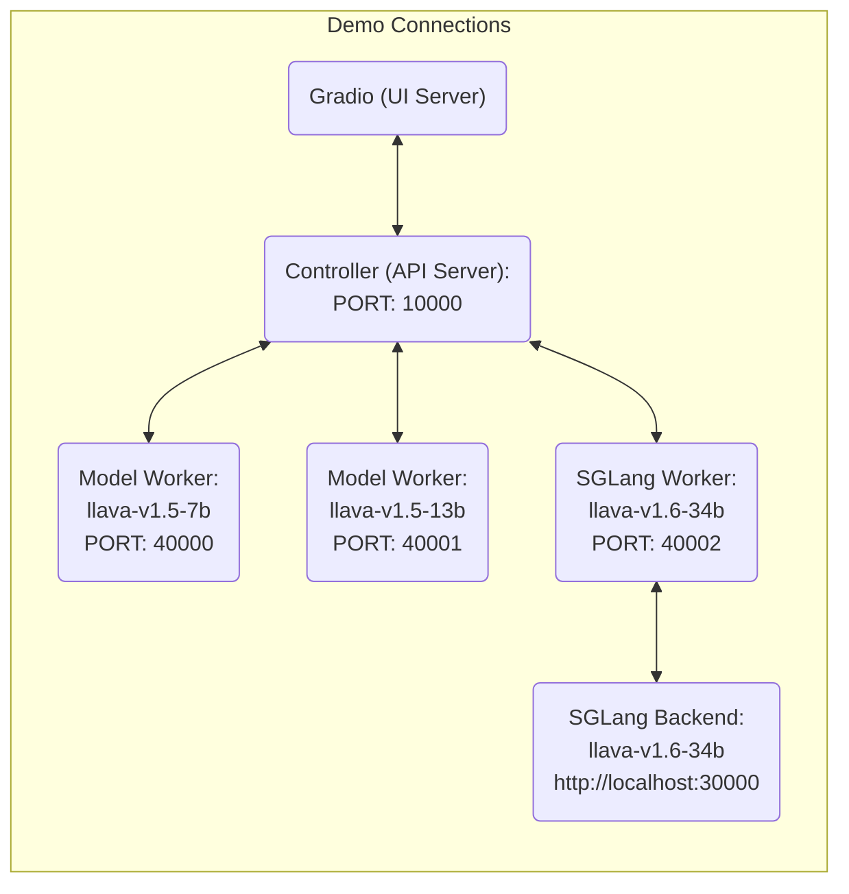

# 🌋 LLaVA: 대규모 언어 및 비전 어시스턴트

*GPT-4 수준의 능력을 갖춘 대규모 언어 및 비전 모델을 위한 시각적 지시 튜닝*

[📢 [LLaVA-NeXT 블로그](https://llava-vl.github.io/blog/2024-01-30-llava-next/)] [[프로젝트 페이지](https://llava-vl.github.io/)] [[데모](https://llava.hliu.cc/)]  [[데이터](https://github.com/haotian-liu/LLaVA/blob/main/docs/Data.md)] [[모델 목록](https://github.com/haotian-liu/LLaVA/blob/main/docs/MODEL_ZOO.md)]

🤝커뮤니티 기여: [[llama.cpp](https://github.com/ggerganov/llama.cpp/pull/3436)] [[Colab](https://github.com/camenduru/LLaVA-colab)] [[🤗Space](https://huggingface.co/spaces/badayvedat/LLaVA)] [[Replicate](https://replicate.com/yorickvp/llava-13b)] [[AutoGen](https://github.com/microsoft/autogen/blob/main/notebook/agentchat_lmm_llava.ipynb)]  [[BakLLaVA](https://github.com/SkunkworksAI/BakLLaVA)]

**시각적 지시 튜닝을 통한 향상된 베이스라인** [[논문](https://arxiv.org/abs/2310.03744)] [[HF](https://huggingface.co/papers/2310.03744)] <br>
[Haotian Liu](https://hliu.cc), [Chunyuan Li](https://chunyuan.li/), [Yuheng Li](https://yuheng-li.github.io/), [Yong Jae Lee](https://pages.cs.wisc.edu/~yongjaelee/)

**시각적 지시 튜닝** (NeurIPS 2023, **구두 발표**) [[논문](https://arxiv.org/abs/2304.08485)] [[HF](https://huggingface.co/papers/2304.08485)] <br>
[Haotian Liu*](https://hliu.cc), [Chunyuan Li*](https://chunyuan.li/), [Qingyang Wu](https://scholar.google.ca/citations?user=HDiw-TsAAAAJ&hl=en/), [Yong Jae Lee](https://pages.cs.wisc.edu/~yongjaelee/) (*공동 1저자)


## 릴리스

- [2024/05/10] 🔥 **LLaVA-NeXT** (더 강력한) 모델이 출시되었습니다. LLama-3 (8B) 및 Qwen-1.5 (72B/110B)를 지원하는 더 강력한 LMM입니다. [[블로그](https://llava-vl.github.io/blog/2024-05-10-llava-next-stronger-llms/)] [[체크포인트](https://huggingface.co/collections/lmms-lab/llava-next-6623288e2d61edba3ddbf5ff)] [[데모](https://llava-next.lmms-lab.com/)] [[코드](https://github.com/LLaVA-VL/LLaVA-NeXT/)]
- [2024/05/10] 🔥 **LLaVA-NeXT** (비디오)가 출시되었습니다. 이미지만으로 훈련된 LLaVA-NeXT 모델이 제로샷 모달리티 전이를 통해 비디오 작업에서 놀라운 성능을 보입니다. 비디오에 대한 AI 피드백을 통한 DPO 훈련으로 상당한 개선을 얻을 수 있습니다. [[블로그](https://llava-vl.github.io/blog/2024-04-30-llava-next-video/)] [[체크포인트](https://huggingface.co/collections/lmms-lab/llava-next-video-661e86f5e8dabc3ff793c944)] [[코드](https://github.com/LLaVA-VL/LLaVA-NeXT/)]
- [03/10] LLaVA-NeXT 개발 시 사용한 고효율 평가 파이프라인인 **LMMs-Eval**을 출시합니다. 수십 개의 공개 데이터셋에서 LMM 평가를 지원하며 새로운 데이터셋 온보딩을 허용하여 새로운 LMM 개발을 훨씬 빠르게 만듭니다. [[블로그](https://lmms-lab.github.io/lmms-eval-blog/lmms-eval-0.1/)] [[코드베이스](https://github.com/EvolvingLMMs-Lab/lmms-eval)]
- [1/30] 🔥 **LLaVA-NeXT** (LLaVA-1.6)가 출시되었습니다! LLaVA-1.5에 추가적인 스케일링을 통해 LLaVA-NeXT-34B는 일부 벤치마크에서 Gemini Pro를 능가합니다. 이제 4배 더 많은 픽셀을 처리하고 이전보다 더 많은 작업/애플리케이션을 수행할 수 있습니다. [블로그 포스트](https://llava-vl.github.io/blog/2024-01-30-llava-next/)를 확인하고 [데모](https://llava.hliu.cc/)를 체험해보세요! 모델은 [모델 목록](https://github.com/haotian-liu/LLaVA/blob/main/docs/MODEL_ZOO.md)에서 사용할 수 있습니다. 훈련/평가 데이터 및 스크립트는 곧 제공됩니다.
- [11/10] [LLaVA-Plus](https://llava-vl.github.io/llava-plus/)가 출시되었습니다: 멀티모달 에이전트 생성을 위한 도구 사용 학습, LLaVA-Plus (기술을 연결하고 사용하는 법을 배우는 LLaVA)와 함께. [[프로젝트 페이지](https://llava-vl.github.io/llava-plus/)] [[데모](https://llavaplus.ngrok.io/)] [[코드](https://github.com/LLaVA-VL/LLaVA-Plus-Codebase)] [[논문](https://arxiv.org/abs/2311.05437)]
- [11/2] [LLaVA-Interactive](https://llava-vl.github.io/llava-interactive/)가 출시되었습니다: 이미지 채팅, 분할, 생성 및 편집을 위한 올인원 데모를 통해 인간-AI 멀티모달 상호작용의 미래를 경험하세요. [[프로젝트 페이지](https://llava-vl.github.io/llava-interactive/)] [[데모](https://llavainteractive.ngrok.io/)] [[코드](https://github.com/LLaVA-VL/LLaVA-Interactive-Demo)] [[논문](https://arxiv.org/abs/2311.00571)]
- [10/26] 🔥 LoRA를 사용한 LLaVA-1.5가 전체 모델 파인튜닝과 비교할 만한 성능을 달성하면서 GPU RAM 요구사항을 줄였습니다 ([체크포인트](https://github.com/haotian-liu/LLaVA/blob/main/docs/MODEL_ZOO.md#llava-v15), [스크립트](https://github.com/haotian-liu/LLaVA#train)). 또한 LoRA를 사용하여 자신의 데이터셋에서 LLaVA-1.5를 파인튜닝하는 방법에 대한 [문서](https://github.com/haotian-liu/LLaVA/blob/main/docs/Finetune_Custom_Data.md)도 제공합니다.
- [10/12] ETRI에서 제작한 한국어 LLaVA (Ko-LLaVA)를 확인해보세요. 우리 연구를 아낌없이 지원해주셨습니다! [[🤗 데모](https://huggingface.co/spaces/etri-vilab/Ko-LLaVA)]
- [10/5] 🔥 LLaVA-1.5가 출시되었습니다! 11개 벤치마크에서 SOTA를 달성하였으며, 원래 LLaVA에 간단한 수정만으로, 모든 공개 데이터를 활용하고, 단일 8-A100 노드에서 ~1일 만에 훈련을 완료하며, 억 단위 규모의 데이터를 사용하는 Qwen-VL-Chat과 같은 방법들을 능가합니다. [기술 보고서](https://arxiv.org/abs/2310.03744)를 확인하고 [데모](https://llava.hliu.cc/)를 체험해보세요! 모델은 [모델 목록](https://github.com/haotian-liu/LLaVA/blob/main/docs/MODEL_ZOO.md)에서 사용할 수 있습니다. LLaVA-1.5의 훈련 데이터와 스크립트는 [여기](https://github.com/haotian-liu/LLaVA#train)에 공개되었고, 평가 스크립트는 [여기](https://github.com/haotian-liu/LLaVA/blob/main/docs/Evaluation.md)에 공개되었습니다!
- [9/26] LLaVA가 사실 기반 개선과 환각 감소를 위해 인간 피드백으로부터의 강화학습(RLHF)으로 개선되었습니다. 프로젝트 [[LLavA-RLHF]](https://llava-rlhf.github.io/)에서 새로운 SFT 및 RLHF 체크포인트를 확인하세요
- [9/22] [LLaVA](https://arxiv.org/abs/2304.08485)가 NeurIPS 2023에서 **구두 발표**로 채택되었고, [LLaVA-Med](https://arxiv.org/abs/2306.00890)는 NeurIPS 2023 Datasets and Benchmarks Track에서 **스포트라이트 발표**로 채택되었습니다.

<details>
<summary>더 보기</summary>

- [11/6] **Intel** dGPU 및 CPU 플랫폼을 지원합니다. [자세한 내용은 여기를 참조하세요.](https://github.com/haotian-liu/LLaVA/tree/intel/docs/intel)
- [10/12] LLaVA가 이제 4비트 / 5비트 양자화 지원과 함께 [llama.cpp](https://github.com/ggerganov/llama.cpp/pull/3436)에서 지원됩니다!
- [10/11] LLaVA-1.5의 훈련 데이터와 스크립트가 [여기](https://github.com/haotian-liu/LLaVA#train)에 공개되었고, 평가 스크립트는 [여기](https://github.com/haotian-liu/LLaVA/blob/main/docs/Evaluation.md)에 공개되었습니다!
- [10/10] [Roboflow Deep Dive](https://blog.roboflow.com/first-impressions-with-llava-1-5/): LLaVA-1.5에 대한 첫 인상.
- [9/20] 33B 및 65B LLaVA 모델 훈련에 대한 실증적 연구를 [노트](https://arxiv.org/abs/2309.09958)로 요약했습니다. 더 나아가, 멀티모달 기초 모델의 포괄적인 리뷰, 진화 및 트렌드에 관심이 있으시다면, 최근 서베이 논문 [``Multimodal Foundation Models: From Specialists to General-Purpose Assistants''](https://arxiv.org/abs/2309.10020)을 확인해주세요.
<p align="center">
  
</p>

- [7/19] 🔥 LLaMA-2 지원, LoRA 훈련, 4-/8-비트 추론, 더 높은 해상도 (336x336) 등을 포함한 주요 업그레이드를 발표합니다. Bard 및 Bing-Chat의 결과와 함께 오픈엔드 시각적 채팅 벤치마킹을 위한 [LLaVA Bench](https://github.com/haotian-liu/LLaVA/blob/main/docs/LLaVA_Bench.md)를 공개합니다. 또한 RTX 3090 및 RTX A6000에서의 훈련을 지원하고 검증했습니다. [LLaVA-from-LLaMA-2](https://github.com/haotian-liu/LLaVA/blob/main/docs/LLaVA_from_LLaMA2.md)와 [모델 목록](https://github.com/haotian-liu/LLaVA/blob/main/docs/MODEL_ZOO.md)을 확인하세요!
- [6/26] **대규모 멀티모달 모델: 멀티모달 GPT-4 구축 및 뛰어넘기**에 대한 [CVPR 2023 튜토리얼](https://vlp-tutorial.github.io/)! [[슬라이드](https://datarelease.blob.core.windows.net/tutorial/vision_foundation_models_2023/slides/Chunyuan_cvpr2023_tutorial_lmm.pdf)] [[노트](https://arxiv.org/abs/2306.14895)] [[YouTube](https://youtu.be/mkI7EPD1vp8)] [[Bilibli](https://www.bilibili.com/video/BV1Ng4y1T7v3/)]를 확인해주세요.
- [6/11] 가장 많이 요청된 기능인 DeepSpeed 및 LoRA 지원 프리뷰를 발표했습니다! 문서는 [여기](./docs/LoRA.md)를 참조하세요.
- [6/1] GPT-4 수준의 능력을 갖춘 생의학 도메인 대규모 언어 및 비전 모델 구축을 향한 한 걸음인 **LLaVA-Med: 생의학을 위한 대규모 언어 및 비전 어시스턴트**를 발표했습니다. [논문](https://arxiv.org/abs/2306.00890)과 [페이지](https://github.com/microsoft/LLaVA-Med)를 확인하세요.
- [5/6] MPT-7B-Chat 기반의 [LLaVA-Lighting-MPT-7B-preview](https://huggingface.co/liuhaotian/LLaVA-Lightning-MPT-7B-preview)를 공개합니다! 자세한 내용은 [여기](#LLaVA-MPT-7b)를 참조하세요.
- [5/2] 🔥 LLaVA-Lighting을 공개합니다! 단 40달러로 3시간 만에 라이트 멀티모달 GPT-4를 훈련하세요! 자세한 내용은 [여기](#train-llava-lightning)를 참조하세요.
- [4/27] 커뮤니티의 노력 덕분에, 4비트 양자화된 LLaVA-13B를 12GB VRAM만으로도 실행할 수 있습니다! [여기](https://github.com/oobabooga/text-generation-webui/tree/main/extensions/llava)에서 시도해보세요.
- [4/17] 🔥 **LLaVA: 대규모 언어 및 비전 어시스턴트**를 발표했습니다. GPT-4 수준의 능력을 갖춘 대규모 언어 및 비전 모델 구축을 위한 시각적 지시 튜닝을 제안합니다. [논문](https://arxiv.org/abs/2304.08485)과 [데모](https://llava.hliu.cc/)를 확인하세요.

</details>

[](https://github.com/tatsu-lab/stanford_alpaca/blob/main/LICENSE)
**사용 및 라이선스 주의사항**: 이 프로젝트는 각각의 원본 라이선스에 따라 제공되는 특정 데이터셋 및 체크포인트를 활용합니다. 사용자는 데이터셋에 대한 [OpenAI 이용 약관](https://openai.com/policies/terms-of-use) 및 데이터셋을 사용하여 훈련된 체크포인트의 기본 언어 모델에 대한 특정 라이선스(예: LLaMA-2 및 Vicuna-v1.5에 대한 [Llama 커뮤니티 라이선스](https://ai.meta.com/llama/license/))를 포함하되 이에 국한되지 않는 이러한 원본 라이선스의 모든 조항을 준수해야 합니다. 이 프로젝트는 원본 라이선스에 명시된 것 이외의 추가적인 제약을 부과하지 않습니다. 또한, 사용자는 데이터셋 및 체크포인트의 사용이 모든 관련 법률 및 규정을 준수하는지 확인해야 합니다.


## 목차
- [설치](#설치)
- [LLaVA 가중치](#llava-가중치)
- [데모](#데모)
- [모델 목록](https://github.com/haotian-liu/LLaVA/blob/main/docs/MODEL_ZOO.md)
- [데이터셋](https://github.com/haotian-liu/LLaVA/blob/main/docs/Data.md)
- [훈련](#훈련)
- [평가](#평가)

## 설치

Linux를 사용하지 않는 경우, 진행하지 *마세요*. [macOS](https://github.com/haotian-liu/LLaVA/blob/main/docs/macOS.md) 및 [Windows](https://github.com/haotian-liu/LLaVA/blob/main/docs/Windows.md) 설명서를 참조하세요.

1. 이 저장소를 복제하고 LLaVA 폴더로 이동
```bash
git clone https://github.com/haotian-liu/LLaVA.git
cd LLaVA
```

2. 패키지 설치
```Shell
conda create -n llava python=3.10 -y
conda activate llava
pip install --upgrade pip  # PEP 660 지원 활성화
pip install -e .
```

3. 훈련 경우를 위한 추가 패키지 설치
```
pip install -e ".[train]"
pip install flash-attn --no-build-isolation
```

### 최신 코드베이스로 업그레이드

```Shell
git pull
pip install -e .

# 업그레이드 시 일부 import 오류가 발생하면,
# 아래 명령을 실행해보세요 (# 제외)
# pip install flash-attn --no-build-isolation --no-cache-dir
```

### HuggingFace를 통한 빠른 시작

<details>
<summary>예제 코드</summary>

```Python
from llava.model.builder import load_pretrained_model
from llava.mm_utils import get_model_name_from_path
from llava.eval.run_llava import eval_model

model_path = "liuhaotian/llava-v1.5-7b"

tokenizer, model, image_processor, context_len = load_pretrained_model(
    model_path=model_path,
    model_base=None,
    model_name=get_model_name_from_path(model_path)
)
```

`llava/model/builder.py`에서 `load_pretrained_model` 함수의 세부사항을 확인하세요.

출력을 쉽게 얻기 위해 `llava/eval/run_llava.py`의 `eval_model` 함수도 사용할 수 있습니다. 이렇게 하면 이 저장소를 다운로드한 후 Colab에서 직접 이 코드를 사용할 수 있습니다.

``` python
model_path = "liuhaotian/llava-v1.5-7b"
prompt = "여기를 방문할 때 주의해야 할 점들은 무엇인가요?"
image_file = "https://llava-vl.github.io/static/images/view.jpg"

args = type('Args', (), {
    "model_path": model_path,
    "model_base": None,
    "model_name": get_model_name_from_path(model_path),
    "query": prompt,
    "conv_mode": None,
    "image_file": image_file,
    "sep": ",",
    "temperature": 0,
    "top_p": None,
    "num_beams": 1,
    "max_new_tokens": 512
})()

eval_model(args)
```
</details>

## LLaVA 가중치
모든 공개 LLaVA 체크포인트와 가중치 사용 방법은 [모델 목록](https://github.com/haotian-liu/LLaVA/blob/main/docs/MODEL_ZOO.md)을 확인하세요.

## 데모

### Gradio 웹 UI

Gradio 데모를 로컬에서 실행하려면 다음 명령을 하나씩 실행하세요. 여러 모델 워커를 실행하여 서로 다른 체크포인트를 비교할 계획이라면, 컨트롤러와 웹 서버는 *한 번*만 실행하면 됩니다.



#### 컨트롤러 실행
```Shell
python -m llava.serve.controller --host 0.0.0.0 --port 10000
```

#### Gradio 웹 서버 실행
```Shell
python -m llava.serve.gradio_web_server --controller http://localhost:10000 --model-list-mode reload
```
Gradio 웹 인터페이스가 실행되었습니다. 이제 화면에 출력된 URL로 웹 인터페이스를 열 수 있습니다. 모델 목록에 모델이 없는 것을 확인할 수 있는데, 아직 모델 워커를 실행하지 않았기 때문이니 걱정하지 마세요. 모델 워커를 실행하면 자동으로 업데이트됩니다.

#### SGLang 워커 실행

이것은 높은 처리량으로 LLaVA 모델을 서빙하는 권장 방법이며, 먼저 SGLang을 설치해야 합니다. 현재 SGLang-LLaVA에서는 `4비트` 양자화가 아직 지원되지 않으므로, GPU VRAM이 제한적이라면 [양자화](https://github.com/haotian-liu/LLaVA?tab=readme-ov-file#launch-a-model-worker-4-bit-8-bit-inference-quantized)를 사용한 모델 워커를 확인하세요.

```Shell
pip install "sglang[all]"
```

먼저 GPU에서 모델을 실행할 SGLang 백엔드 워커를 실행합니다. 설정한 `--port`를 기억해두고 나중에 사용하세요.

```Shell
# 단일 GPU
CUDA_VISIBLE_DEVICES=0 python3 -m sglang.launch_server --model-path liuhaotian/llava-v1.5-7b --tokenizer-path llava-hf/llava-1.5-7b-hf --port 30000

# 텐서 병렬을 사용한 다중 GPU
CUDA_VISIBLE_DEVICES=0,1 python3 -m sglang.launch_server --model-path liuhaotian/llava-v1.5-13b --tokenizer-path llava-hf/llava-1.5-13b-hf --port 30000 --tp 2
```

토크나이저 (임시): `llava-hf/llava-1.5-7b-hf`, `llava-hf/llava-1.5-13b-hf`, `liuhaotian/llava-v1.6-34b-tokenizer`.

그런 다음 LLaVA 컨트롤러와 SGLang 백엔드 사이의 통신을 담당하여 요청을 라우팅하는 LLaVA-SGLang 워커를 실행합니다. `--sgl-endpoint`를 방금 설정한 포트인 `http://127.0.0.1:port`로 설정하세요 (기본값: 30000).

```Shell
python -m llava.serve.sglang_worker --host 0.0.0.0 --controller http://localhost:10000 --port 40000 --worker http://localhost:40000 --sgl-endpoint http://127.0.0.1:30000
```

#### 모델 워커 실행

이것은 GPU에서 추론을 수행하는 실제 *워커*입니다. 각 워커는 `--model-path`에 지정된 단일 모델을 담당합니다.

```Shell
python -m llava.serve.model_worker --host 0.0.0.0 --controller http://localhost:10000 --port 40000 --worker http://localhost:40000 --model-path liuhaotian/llava-v1.5-13b
```
프로세스가 모델 로딩을 완료하고 "Uvicorn running on ..."이 표시될 때까지 기다리세요. 이제 Gradio 웹 UI를 새로고침하면 방금 실행한 모델이 모델 목록에 표시됩니다.

원하는 만큼 워커를 실행할 수 있으며, 같은 Gradio 인터페이스에서 서로 다른 모델 체크포인트를 비교할 수 있습니다. `--controller`는 동일하게 유지하고, 각 워커마다 `--port`와 `--worker`를 다른 포트 번호로 수정하세요.
```Shell
python -m llava.serve.model_worker --host 0.0.0.0 --controller http://localhost:10000 --port <40000과 다른 번호, 예: 40001> --worker http://localhost:<그에 맞게 변경, 즉 40001> --model-path <ckpt2>
```

M1 또는 M2 칩이 있는 Apple 장치를 사용하는 경우, `--device` 플래그를 사용하여 mps 장치를 지정할 수 있습니다: `--device mps`.

#### 모델 워커 실행 (다중 GPU, GPU VRAM <= 24GB일 때)

GPU의 VRAM이 24GB 미만인 경우 (예: RTX 3090, RTX 4090 등), 다중 GPU로 실행해 볼 수 있습니다. 최신 코드베이스는 GPU가 두 개 이상 있으면 자동으로 다중 GPU를 사용하려고 시도합니다. `CUDA_VISIBLE_DEVICES`로 사용할 GPU를 지정할 수 있습니다. 아래는 처음 두 개 GPU로 실행하는 예입니다.

```Shell
CUDA_VISIBLE_DEVICES=0,1 python -m llava.serve.model_worker --host 0.0.0.0 --controller http://localhost:10000 --port 40000 --worker http://localhost:40000 --model-path liuhaotian/llava-v1.5-13b
```

#### 모델 워커 실행 (4비트, 8비트 추론, 양자화)

양자화된 비트(4비트, 8비트)로 모델 워커를 실행할 수 있으며, 이를 통해 GPU 메모리 사용량을 줄여 12GB VRAM만으로도 추론을 실행할 수 있습니다. 양자화된 비트로 추론하는 것이 전체 정밀도 모델만큼 정확하지 않을 수 있다는 점에 유의하세요. 실행 중인 **모델 워커** 명령에 `--load-4bit` 또는 `--load-8bit`를 간단히 추가하면 됩니다. 아래는 4비트 양자화로 실행하는 예입니다.

```Shell
python -m llava.serve.model_worker --host 0.0.0.0 --controller http://localhost:10000 --port 40000 --worker http://localhost:40000 --model-path liuhaotian/llava-v1.5-13b --load-4bit
```

#### 모델 워커 실행 (LoRA 가중치, 병합되지 않음)

기본 체크포인트와 병합하지 않고 LoRA 가중치로 모델 워커를 실행하여 디스크 공간을 절약할 수 있습니다. 추가 로딩 시간이 있지만 추론 속도는 병합된 체크포인트와 동일합니다. 병합되지 않은 LoRA 체크포인트는 모델 이름에 `lora-merge`가 없으며, 병합된 체크포인트(7B의 경우 13G, 13B의 경우 25G)보다 일반적으로 훨씬 작습니다 (1GB 미만).

병합되지 않은 LoRA 가중치를 로드하려면, LoRA 가중치 훈련에 사용된 기본 LLM인 추가 인수 `--model-base`를 전달하기만 하면 됩니다. [모델 목록](https://github.com/haotian-liu/LLaVA/blob/main/docs/MODEL_ZOO.md)에서 각 LoRA 가중치의 기본 LLM을 확인할 수 있습니다.

```Shell
python -m llava.serve.model_worker --host 0.0.0.0 --controller http://localhost:10000 --port 40000 --worker http://localhost:40000 --model-path liuhaotian/llava-v1-0719-336px-lora-vicuna-13b-v1.3 --model-base lmsys/vicuna-13b-v1.3
```

### CLI 추론

Gradio 인터페이스 없이 LLaVA를 사용하여 이미지에 대해 채팅할 수 있습니다. 다중 GPU, 4비트 및 8비트 양자화 추론도 지원합니다. 4비트 양자화를 사용하면 LLaVA-1.5-7B가 단일 GPU에서 8GB VRAM 미만을 사용합니다.

```Shell
python -m llava.serve.cli \
    --model-path liuhaotian/llava-v1.5-7b \
    --image-file "https://llava-vl.github.io/static/images/view.jpg" \
    --load-4bit
```


## 훈련

*아래는 LLaVA v1.5의 최신 훈련 구성입니다. 레거시 모델의 경우 지금은 [이](https://github.com/haotian-liu/LLaVA/tree/v1.0.1) 버전의 README를 참조하세요. 나중에 별도의 문서에 추가하겠습니다.*

LLaVA 훈련은 두 단계로 구성됩니다: (1) 특징 정렬 단계: LAION-CC-SBU 데이터셋의 558K 부분집합을 사용하여 *동결된 사전훈련* 비전 인코더를 *동결된 LLM*에 연결; (2) 시각적 지시 튜닝 단계: 150K GPT 생성 멀티모달 지시 따라하기 데이터와 학술 지향 작업의 약 515K VQA 데이터를 사용하여 모델이 멀티모달 지시를 따르도록 가르칩니다.

LLaVA는 80GB 메모리를 가진 8개의 A100 GPU에서 훈련됩니다. 더 적은 GPU에서 훈련하려면 `per_device_train_batch_size`를 줄이고 `gradient_accumulation_steps`를 그에 맞게 증가시킬 수 있습니다. 전역 배치 크기는 항상 동일하게 유지하세요: `per_device_train_batch_size` x `gradient_accumulation_steps` x `num_gpus`.

### 하이퍼파라미터
파인튜닝에서 Vicuna와 유사한 하이퍼파라미터 세트를 사용합니다. 사전훈련과 파인튜닝에서 사용된 하이퍼파라미터는 아래에 제공됩니다.

1. 사전훈련

| 하이퍼파라미터 | 전역 배치 크기 | 학습률 | 에포크 | 최대 길이 | 가중치 감쇠 |
| --- | ---: | ---: | ---: | ---: | ---: |
| LLaVA-v1.5-13B | 256 | 1e-3 | 1 | 2048 | 0 |

2. 파인튜닝

| 하이퍼파라미터 | 전역 배치 크기 | 학습률 | 에포크 | 최대 길이 | 가중치 감쇠 |
| --- | ---: | ---: | ---: | ---: | ---: |
| LLaVA-v1.5-13B | 128 | 2e-5 | 1 | 2048 | 0 |

### Vicuna 체크포인트 다운로드 (자동)

지시 튜닝된 챗봇인 기본 모델 Vicuna v1.5는 제공된 훈련 스크립트를 실행할 때 자동으로 다운로드됩니다. 별도의 조치는 필요하지 않습니다.

### 사전훈련 (특징 정렬)

논문에서 사용한 BLIP 캡션이 있는 LAION-CC-SBU 데이터셋의 558K 부분집합을 [여기](https://huggingface.co/datasets/liuhaotian/LLaVA-Pretrain)에서 다운로드하세요.

해상도가 336px로 증가하여 LLaVA-v1.5-13B의 사전훈련은 8x A100 (80G)에서 약 5.5시간이 소요됩니다. LLaVA-v1.5-7B는 약 3.5시간이 소요됩니다.

DeepSpeed ZeRO-2를 사용한 훈련 스크립트: [`pretrain.sh`](https://github.com/haotian-liu/LLaVA/blob/main/scripts/v1_5/pretrain.sh).

- `--mm_projector_type mlp2x_gelu`: 2층 MLP 비전-언어 커넥터.
- `--vision_tower openai/clip-vit-large-patch14-336`: CLIP ViT-L/14 336px.

<details>
<summary>사전훈련은 8x V100 (32G)에서 LLaVA-7B에 대해 약 20시간이 소요됩니다</summary>

DeepSpeed를 사용한 훈련 스크립트를 [여기](https://github.com/haotian-liu/LLaVA/blob/main/scripts/pretrain_xformers.sh)에서 제공합니다.
팁:
- FlashAttention을 지원하지 않는 V100을 사용하는 경우, [xFormers](https://github.com/facebookresearch/xformers)에 구현된 [메모리 효율적 어텐션](https://arxiv.org/abs/2112.05682)을 사용할 수 있습니다. xformers를 설치하고 위의 `llava/train/train_mem.py`를 [llava/train/train_xformers.py](llava/train/train_xformers.py)로 교체하세요.
</details>

### 시각적 지시 튜닝

1. 데이터 준비

최종 혼합 지시 튜닝 데이터의 어노테이션 [llava_v1_5_mix665k.json](https://huggingface.co/datasets/liuhaotian/LLaVA-Instruct-150K/blob/main/llava_v1_5_mix665k.json)을 다운로드하고, 구성 데이터셋에서 이미지를 다운로드하세요:

- COCO: [train2017](http://images.cocodataset.org/zips/train2017.zip)
- GQA: [images](https://downloads.cs.stanford.edu/nlp/data/gqa/images.zip)
- OCR-VQA: [다운로드 스크립트](https://drive.google.com/drive/folders/1_GYPY5UkUy7HIcR0zq3ZCFgeZN7BAfm_?usp=sharing), **모든 파일을 `.jpg`로 저장합니다**
- TextVQA: [train_val_images](https://dl.fbaipublicfiles.com/textvqa/images/train_val_images.zip)
- VisualGenome: [part1](https://cs.stanford.edu/people/rak248/VG_100K_2/images.zip), [part2](https://cs.stanford.edu/people/rak248/VG_100K_2/images2.zip)

모든 것을 다운로드한 후, `./playground/data`에서 다음과 같이 데이터를 구성하세요,

```
├── coco
│   └── train2017
├── gqa
│   └── images
├── ocr_vqa
│   └── images
├── textvqa
│   └── train_images
└── vg
    ├── VG_100K
    └── VG_100K_2
```

2. 훈련 시작!

[모델 목록](https://github.com/haotian-liu/LLaVA/blob/main/docs/MODEL_ZOO.md)에서 사전훈련된 프로젝터를 다운로드할 수 있습니다. 레거시 프로젝터는 다른 버전의 코드베이스로 훈련되었을 수 있고, 옵션이 맞지 않으면 모델이 예상대로 기능/훈련되지 않을 수 있으므로 사용하지 않는 것이 좋습니다.

해상도가 336px로 증가하여 시각적 지시 튜닝은 8x A100 (80G)에서 LLaVA-v1.5-13B에 대해 약 20시간이 소요됩니다. 8x A100 (40G)에서 LLaVA-v1.5-7B는 약 10시간이 소요됩니다.

DeepSpeed ZeRO-3를 사용한 훈련 스크립트: [`finetune.sh`](https://github.com/haotian-liu/LLaVA/blob/main/scripts/v1_5/finetune.sh).

GPU 메모리가 충분하지 않은 경우:

- LoRA 사용: [`finetune_lora.sh`](https://github.com/haotian-liu/LLaVA/blob/main/scripts/v1_5/finetune_lora.sh). 8-A100-40G/8-A6000에서 13B 훈련을, 8-RTX3090에서 7B 훈련을 맞출 수 있습니다. 최상의 재현성을 위해 `per_device_train_batch_size*gradient_accumulation_steps`가 제공된 스크립트와 동일한지 확인하세요.
- 일부 매개변수를 CPU RAM으로 오프로드하는 `zero3_offload.json`으로 `zero3.json`을 교체하세요. 이는 훈련 속도를 늦춥니다.

LLaVA 모델을 자신의 작업/데이터에 파인튜닝하는 데 관심이 있다면 [`Finetune_Custom_Data.md`](https://github.com/haotian-liu/LLaVA/blob/main/docs/Finetune_Custom_Data.md)를 확인하세요.

새로운 옵션들:

- `--mm_projector_type mlp2x_gelu`: 2층 MLP 비전-언어 커넥터.
- `--vision_tower openai/clip-vit-large-patch14-336`: CLIP ViT-L/14 336px.
- `--image_aspect_ratio pad`: 비정사각형 이미지를 자르는 대신 정사각형으로 패딩합니다; 환각을 약간 줄입니다.
- `--group_by_modality_length True`: 지시 튜닝 데이터셋에 언어(예: ShareGPT)와 멀티모달(예: LLaVA-Instruct) 모두가 포함된 경우에만 사용해야 합니다. 훈련 중에 단일 모달리티(이미지 또는 언어)만 샘플링하도록 훈련 샘플러를 만들며, 이는 약 25% 훈련 속도를 향상시키고 최종 결과에는 영향을 주지 않습니다.

## 평가

LLaVA-1.5에서는 12개의 다양한 벤치마크에서 모델을 평가합니다. 재현성을 보장하기 위해 그리디 디코딩으로 모델을 평가합니다. 실시간 출력의 채팅 데모와 일관된 추론 과정을 만들기 위해 빔 서치를 사용한 평가는 하지 않습니다.

[Evaluation.md](https://github.com/haotian-liu/LLaVA/blob/main/docs/Evaluation.md)를 참조하세요.

### GPT 지원 평가

멀티모달 모델링을 위한 GPT 지원 평가 파이프라인은 비전-언어 모델의 능력을 포괄적으로 이해하기 위해 제공됩니다. 자세한 내용은 논문을 참조하세요.

1. LLaVA 응답 생성

```Shell
python model_vqa.py \
    --model-path ./checkpoints/LLaVA-13B-v0 \
    --question-file \
    playground/data/coco2014_val_qa_eval/qa90_questions.jsonl \
    --image-folder \
    /path/to/coco2014_val \
    --answers-file \
    /path/to/answer-file-our.jsonl
```

2. 생성된 응답 평가. 우리의 경우, [`answer-file-ref.jsonl`](./playground/data/coco2014_val_qa_eval/qa90_gpt4_answer.jsonl)은 제공된 컨텍스트 캡션/박스와 함께 텍스트 전용 GPT-4 (0314)에 의해 생성된 응답입니다.

```Shell
OPENAI_API_KEY="sk-***********************************" python llava/eval/eval_gpt_review_visual.py \
    --question playground/data/coco2014_val_qa_eval/qa90_questions.jsonl \
    --context llava/eval/table/caps_boxes_coco2014_val_80.jsonl \
    --answer-list \
    /path/to/answer-file-ref.jsonl \
    /path/to/answer-file-our.jsonl \
    --rule llava/eval/table/rule.json \
    --output /path/to/review.json
```

3. 평가 결과 요약

```Shell
python summarize_gpt_review.py
```

## 인용

연구 및 애플리케이션에서 LLaVA가 유용하다고 생각되면 이 BibTeX를 사용하여 인용해주세요:
```bibtex
@misc{liu2024llavanext,
    title={LLaVA-NeXT: Improved reasoning, OCR, and world knowledge},
    url={https://llava-vl.github.io/blog/2024-01-30-llava-next/},
    author={Liu, Haotian and Li, Chunyuan and Li, Yuheng and Li, Bo and Zhang, Yuanhan and Shen, Sheng and Lee, Yong Jae},
    month={January},
    year={2024}
}

@misc{liu2023improvedllava,
      title={Improved Baselines with Visual Instruction Tuning},
      author={Liu, Haotian and Li, Chunyuan and Li, Yuheng and Lee, Yong Jae},
      publisher={arXiv:2310.03744},
      year={2023},
}

@misc{liu2023llava,
      title={Visual Instruction Tuning},
      author={Liu, Haotian and Li, Chunyuan and Wu, Qingyang and Lee, Yong Jae},
      publisher={NeurIPS},
      year={2023},
}
```

## 감사의 글

- [Vicuna](https://github.com/lm-sys/FastChat): 우리가 구축한 코드베이스이자 놀라운 언어 능력을 가진 기본 모델 Vicuna-13B!

## 관련 프로젝트

- [GPT-4를 이용한 지시 튜닝](https://github.com/Instruction-Tuning-with-GPT-4/GPT-4-LLM)
- [LLaVA-Med: 하루 만에 생의학을 위한 대규모 언어-비전 어시스턴트 훈련](https://github.com/microsoft/LLaVA-Med)
- [Otter: 문맥 내 멀티모달 지시 튜닝](https://github.com/Luodian/Otter)

향후 프로젝트 아이디어는 다음을 확인하세요:
- [SEEM: 모든 곳의 모든 것을 한 번에 분할](https://github.com/UX-Decoder/Segment-Everything-Everywhere-All-At-Once)
- [Grounded-Segment-Anything](https://github.com/IDEA-Research/Grounded-Segment-Anything): [Grounding DINO](https://github.com/IDEA-Research/GroundingDINO)와 [Segment-Anything](https://github.com/facebookresearch/segment-anything)을 결합하여 무엇이든 감지, 분할, 생성합니다.